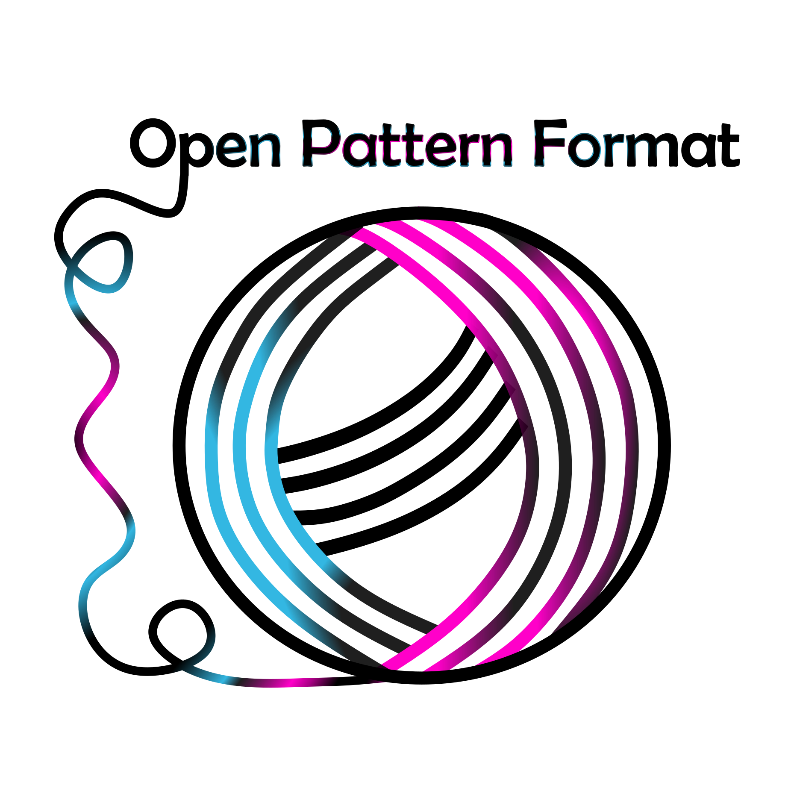

    

`OPAF` is a comprehensive pattern file format aimed at yarn based crafts including knitting and crochet. The pattern is defined using a custom XML like syntax and can be compiled to a true XML interpretation using any of the supported libraries.

Patterns are built using `blocks` where components, rows or individual pattern repeats are defined and called on as necessary in your main pattern definition. You can define configurable values for things like stitch count and use math expressions and conditions throughout to generate bespoke patterns based on size, gauge or other parameters.

##  Features

* Value definitions
* Block definitions for pattern repeats
* Math based expressions with common functions (e.g. ROUND, MROUND, LT, GT)
* Conditions
* Chart definitions
* Common `actions` pre-defined
* Define your own `actions`
